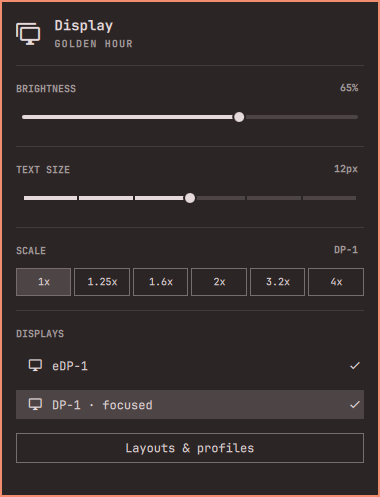

# Display & Profiles

One Display icon for Omarchy’s brightness, text size, scaling and display controls, with a **Layouts & profiles** action that opens the existing hyprmoncfg editor. Both pointer and keyboard navigation are supported.



This is a companion clone of Omarchy’s Display widget. It does not implement monitor matching, saved profiles or preview transactions. Those remain in [hyprmoncfg](https://github.com/crmne/hyprmoncfg) and its [Omarchy plugin](https://github.com/crmne/omarchy-hyprmoncfg).

## Requirements

- Omarchy 4 Quattro. Tested on Omarchy `4.0.4-1`, x86_64, with two physical displays.
- `crmne.hyprmoncfg` installed, enabled and **kept in the bar layout**.
- The `showBarIcon` setting from [hyprmoncfg plugin PR #21](https://github.com/crmne/omarchy-hyprmoncfg/pull/21) is needed to hide its separate icon. The editor also works without the setting, but both icons remain visible.
- Omarchy’s standard Qt/Quickshell, monitor-state, brightness, text-size and scaling commands. The hyprmoncfg plugin has its own documented backend requirements.

## Install

Review the source before enabling it. Omarchy plugins execute in the desktop shell.

For a new hyprmoncfg installation, this temporary fork includes the optional icon setting while PR #21 is pending:

```bash
omarchy plugin add https://github.com/keylimesoda/omarchy-hyprmoncfg --enable
```

If hyprmoncfg is already installed, do not add a second copy with the same ID. Wait for PR #21 and update the existing installation, or review and fast-forward a clean checkout to the fork’s fixed commit `697b44a91e695d797bf272ef68ca1a222146c714`. Keep backups of any local changes.

Install this companion:

```bash
omarchy plugin add https://github.com/keylimesoda/omarchy-display-profiles --enable
omarchy bar set crmne.hyprmoncfg showBarIcon false
```

Enabling replaces the stock `omarchy.monitor` bar entry in place. If you already use a custom Display clone, disable that clone first or replace its entry in Bar Settings; the companion does not overwrite your custom plugin files. The second command is an explicit configuration change that hides only hyprmoncfg’s icon. Removing its bar entry would remove the route to its editor.

The companion does not install packages or enable/manage the backend daemon. In particular, the daemon retry fix in [hyprmoncfg PR #77](https://github.com/crmne/hyprmoncfg/pull/77) is a separate change and is not bundled here.

## Use

Open Display, then choose **Layouts & profiles** with the pointer or move through the menu with arrows/j/k and press Enter. Display closes only when the editor opens successfully. A failed launch leaves an error in the Display menu.

The menu retains Omarchy’s direct brightness, text-size, scale and display-toggle controls. These are live controls with the same behavior as stock Display, separate from hyprmoncfg’s previewed profile editor. The companion starts no additional monitor watcher.

## Update and remove

```bash
omarchy plugin update io.github.keylimesoda.display-profiles
```

To return to the stock menu and show the separate editor icon:

```bash
omarchy bar set crmne.hyprmoncfg showBarIcon true
omarchy plugin remove io.github.keylimesoda.display-profiles
```

Omarchy’s clone lifecycle restores `omarchy.monitor` in the companion’s bar position. Removing this companion leaves hyprmoncfg, its daemon and saved profiles installed. The companion owns no persistent data outside Omarchy’s normal plugin installation and shell configuration. A previous custom Display clone stays on disk and can be enabled again.

## Validation and preview

```bash
./tests/run
omarchy plugin validate .
```

[Validation notes](VALIDATION.md) describe the tested scope. The preview shows the real hosted QML menu with committed fictional display data. [demo/README.md](demo/README.md) explains its reversible capture harness. The screenshot contains no personal desktop content.

## Dependencies, permissions and support

The plugin launches `omarchy-monitor-state`, Omarchy’s existing brightness/text-size/scaling commands, `hyprctl` for stock display toggles, and `omarchy-shell shell summon crmne.hyprmoncfg`. These commands inherit the user session. There is no runtime download, network request, credential storage or privileged installer in this companion. Omarchy’s inherited monitor state collection uses the host command’s output contract. The plugin is unsandboxed; static validation is not a security audit.

Report problems through [GitHub issues](https://github.com/keylimesoda/omarchy-display-profiles/issues). For a security concern, use [GitHub’s private vulnerability reporting](https://github.com/keylimesoda/omarchy-display-profiles/security/advisories/new).

## License and credits

MIT. The Display widget and model are derived from [Omarchy](https://github.com/omacom/omarchy), copyright David Heinemeier Hansson; menu integration additions are copyright 2026 keylimesoda. The original MIT notice is preserved in [LICENSE](LICENSE). The preview is generated from this licensed widget with fictional fixture data; no third-party artwork is included.

Native integration is proposed in [Omarchy PR #13831](https://github.com/omacom/omarchy/pull/13831). Once both upstream changes ship, this companion can be removed in favor of the native menu.
